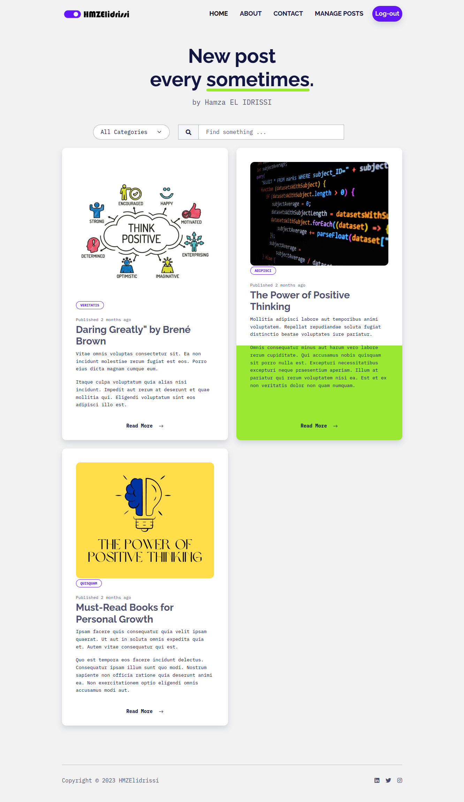
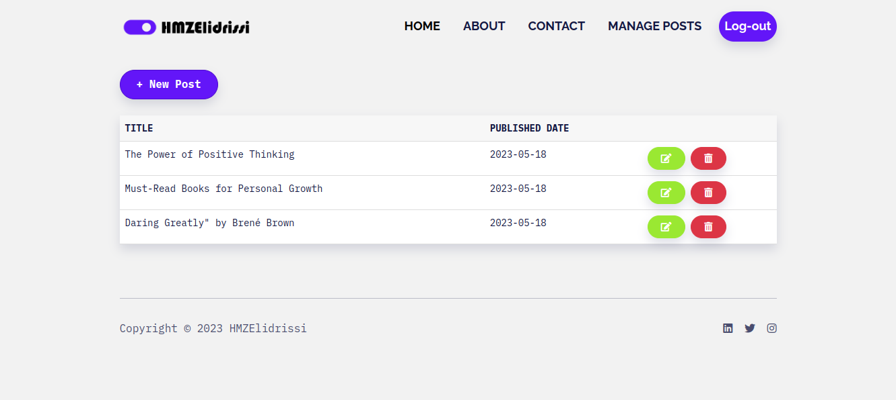

# Personal Blog built with Laravel

[](https://opensource.org/licenses/MIT)

## Description

This is a personal blog web application built using the Laravel framework. The blog allows users to create, read, update, and delete blog posts. It also includes user authentication.

## Screenshots


*Figure 1: Home page showcasing the posts.*


*Figure 2: Admin dashboard for adding, editing and deleting posts.*

## Installation

1. Clone the repository:

   ```bash
   git clone https://github.com/HMZElidrissi/laravel-blog.git
   ```

2. Install composer dependencies:

   ```bash
   cd personal-blog-laravel
   composer install
   ```

3. Create a copy of the `.env.example` file and rename it to `.env`:

   ```bash
   cp .env.example .env
   ```

4. Generate an application key:

   ```bash
   php artisan key:generate
   ```

5. Configure the database connection in the `.env` file:

   ```ini
   DB_CONNECTION=mysql
   DB_HOST=127.0.0.1
   DB_PORT=3306
   DB_DATABASE=your_database_name
   DB_USERNAME=your_database_username
   DB_PASSWORD=your_database_password
   ```

6. Run database migrations and seed the database:

   ```bash
   php artisan migrate --seed
   ```

7. Serve the application:

   ```bash
   php artisan serve
   ```
8. Run this commmand in order for the thumbnails to show:

   ```bash
   php artisan storage:link
   ```
   
9. Visit `http://localhost:8000` in your web browser to access the blog.

## Contributing

Contributions are welcome! If you find any issues or have suggestions, feel free to create a pull request.

## License

This project is open-source and available under the [MIT License](https://opensource.org/licenses/MIT).
